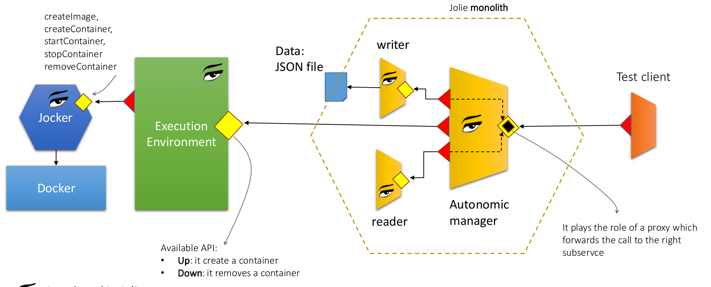

# Toward Autonomic Microservices
This is the proof of concept related to the presentation ["Towards Autonomic Microservices"](https://www.conf-micro.services/2020/papers/paper_5.pdf) given at the [Microservice Conference 2020](https://www.conf-micro.services/2020/program/). The main idea of this example, is to show how an autonomic microservice approach could be achieved. There is not any intent to cover all the possible scenarios, just to point out that a microservice could negotiate some kind of actions with the executing environment, by its own. In particular, here the microservice application asks to the execution environment to scale one of its internal components. The microservice autonomously monitors the response time and, when a threshold is passed, it triggers a request for scaling to the execution environment.

## The architecture
In the following we report the architecture of the example:



The execution environment is simulated by a microservice which exhibits an interface `OperationalInterface` where two operations are available: `up` and `down` which allows for starting and stopping an instance of a service, respectively. The Execution Environment microservices implements both `up` and `down` running a container into the underlying [Docker](https://www.docker.com/) layer. The interaction with the daemon docker is mediated by [Jolie](https://www.jolie-lang.org/), an experimental microservice developed in Jolie which offers a subset of the docker API in order to be used with jolie sodep protocol.

The sample microservice, equipped with autonomic behaviour, is composed by three microservices developed in jolie and deployed as a unique artifact thanks to the [embedding](https://docs.jolie-lang.org/v1.10.x/language-tools-and-standard-library/architectural-composition/embedding.html) primitive. Such a microservice receives a bunch of requests from a fake client and, depending on the monitored response time, it interacts with the Execution Environment for starting or removing a service instance. 

In the following, we briefly describe each component of this architecture. Since all the components are developed using Jolie, the reader may consult the official Jolie [documentation](https://docs.jolie-lang.org/v1.10.x/) for more details.

## The Execution Environment
The Execution Environment exhibits four operations. Two are for external usage, `up` and `down` and two are for internal usage `getPort` and `freePort`. `getPort` and `freePort` allows for the management of the available ports in the current host. Indeed, the Execution Environment is in charge to control all the ports joined with the services. Operations `up` and `down` implements the call towards joker in order to instantiate a container with the received service definition inside. In particular, the definition `__prepare_docker_image` is in charge to prepare the temporary directory from which building the docker image from which a container can be created.

## The sample microservice
The sample microservice is just in charge to control a data source that is a json file (in the example it containes a list of hotels). A microservice called `writer.ol` is in charge to control the writing operations, whereas the microservices `reader.ol` (stored into folder packages) is in charge to offer reading operations. The reader does to nread directly from the file, but it just has an in memory cache from which reading the data. `autonomic_manager` is the service that plays the following roles:

* _Embedder_: it embeds both the writer and the reader
* _Gateway_: it aggregates the operations of both the reader and the writer, offering the resuting endpoint
* _Monitor_: it calculates the response time average of all reader operations
* _Autonomic Executor_: it requests for a new instance to the Execution Environment, it also asks for removing an instance when the response time decreases
* _Load Balancer_: it balances the incoming requests for the readers among all the available instances of the readers
* _Synchronizer_: it synchronizes the caches of all the readers when a writing operations is performed

Note that the _Monitor_ artificially simulates a delay in response time which increases until 50 calls are reached, then it starts to decrease.
New services are computed considering a simple hysteresis.

# Running the PoC

## Requirements
In order to run the PoC you need:


* [Jolie](https://www.jolie-lang.org/)
* [Docker](https://www.docker.com/)
* [Jocker](https://jolielang.gitbook.io/docs/language-tools-and-standard-library/containerization/docker/jocker)

## Running Jocker
Assumming docker is installed and working, run the jocker container:
```
docker pull jolielang/jocker
docker run -it -p 8008:8008 --name jocker -v /var/run:/var/run jolielang/jocker
```

## Running the simulator of the Execution Environment
Open a shell into folder `ExecutionEnvironment` and run the following command:
```
jolie main_execution_environment.ol
```

## Running the sample microservice
The sample microservice can be run within a container, here we describe its execution on a local shell just for allowing a direct observation of its behaviour. It is possible to run it inside a container following these [instructions](https://jolielang.gitbook.io/docs/language-tools-and-standard-library/containerization/docker) 

Open a shell into folder `Sample` and run the following command
```
jolie autonomic_manager.ol
```

## Running a test client
In order to sending requests to the sample microservice, open a shell into folder `clients` and run the following commands:
```
jolie client_reader.ol 200
```
where 200 is the number of requests sent to the sample microservice. The sample microservice simulate delays in the responses and will enable the deployment of new containers for its subservice `reader`. After 50 calls the delay simulator cut the delay simulating a well performing scenario and the sample service will remove the instantiated containers.


